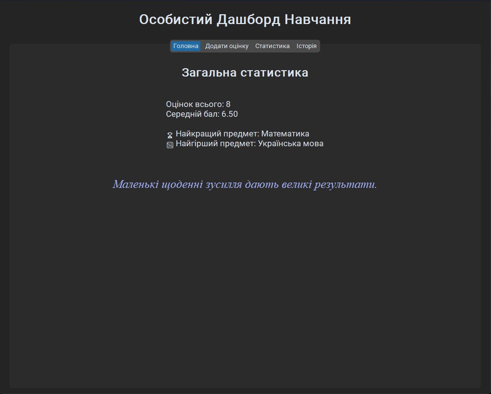
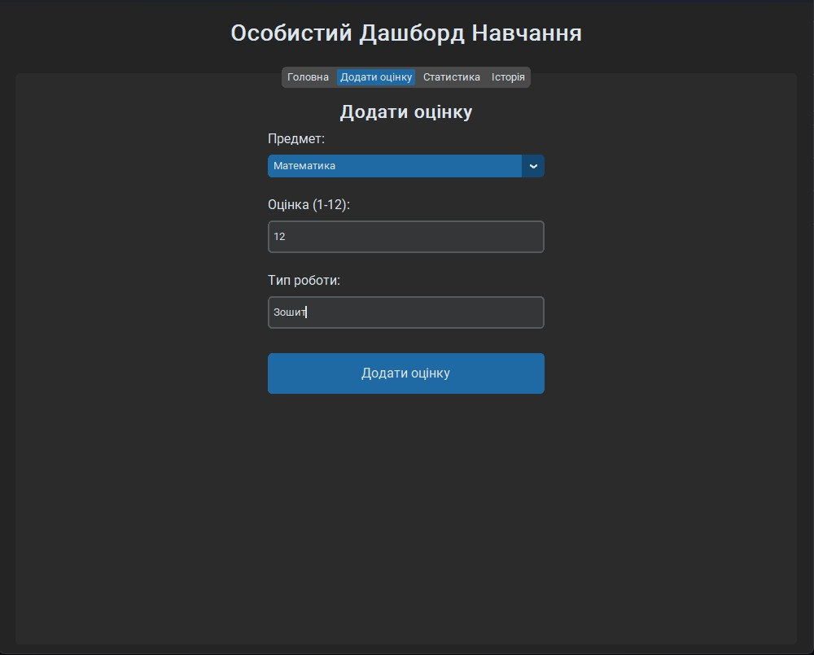
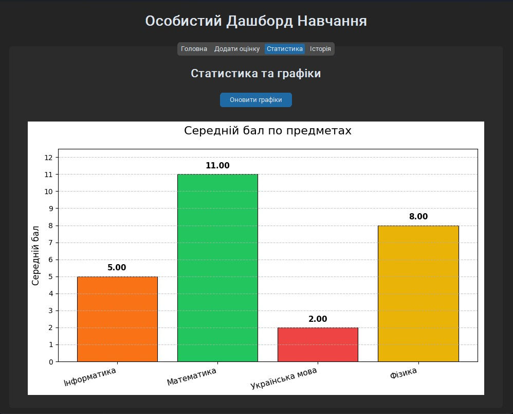
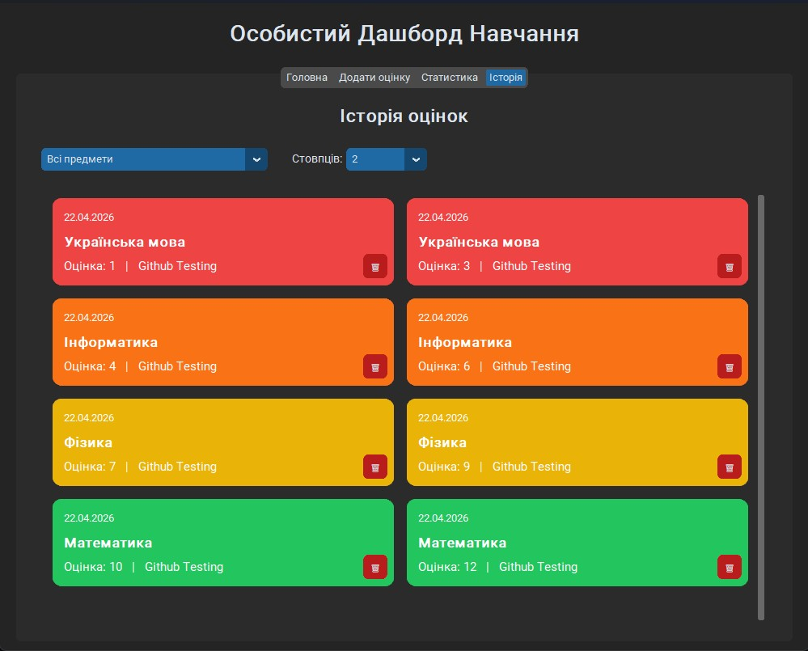

# Особистий Дашборд Навчання

**Сучасний інструмент для відстеження шкільних оцінок та прогресу** - потужний помічник для відстеження прогресу навчання

Програма допомагає учням вести облік оцінок, аналізувати успішність, бачити динаміку та мотивацію в одному зручному додатку.


## Основні можливості

- Додавання оцінок з вибором предмета та типу роботи
- Автоматичний розрахунок середнього балу
- Кращий та найгірший предмет
- Красива вкладка **Історія** з кольоровим кодуванням оцінок та кнопками видалення
- Вибір кількості стовпців у історії (1, 2 або 3)
- Графіки середнього балу по предметах
- Мотиваційні цитати на головній сторінці
- Збереження всіх даних між запусками програми

## Скриншоти






## Вимоги

- Python 3.10 або новіший

### Встановлення залежностей

```bash
pip install customtkinter matplotlib numpy
```

## Як запустити

1. Завантажте всі файли проекту
2. Відкрийте термінал у папці проекту
3. Виконайте:

```bash
python main.py
```

## Структура проекту

```
study-dashboard/
├── main.py              # Головний файл
├── data_manager.py      # Робота з даними (оцінки)
├── graphs.py            # Генерація графіків
├── data/
│   └── grades.json      # Збережені оцінки
└── README.md
```

## Технології

- **CustomTkinter** — сучасний та красивий інтерфейс
- **Matplotlib** — побудова графіків
- **JSON** — збереження даних

## Для кого цей проект

- Школярі 8–11 класів
- Абітурієнти, які готуються до ЗНО/НМТ
- Студенти технічних спеціальностей
- Усі, хто хоче системно відстежувати свою успішність

---
**Створено у квітні 2026**  
Автор: Огмрцян Максим

Цей проект є частиною мого портфоліо для вступу до вищих навчальних закладів України (КПІ, ОПУ, ЛНУ та інші).
---
